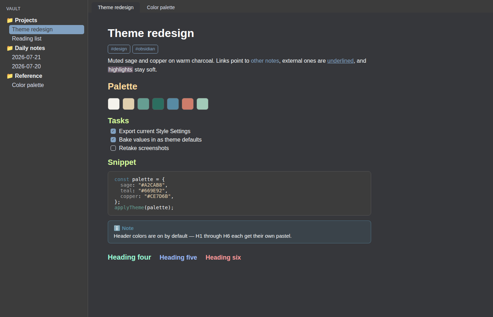
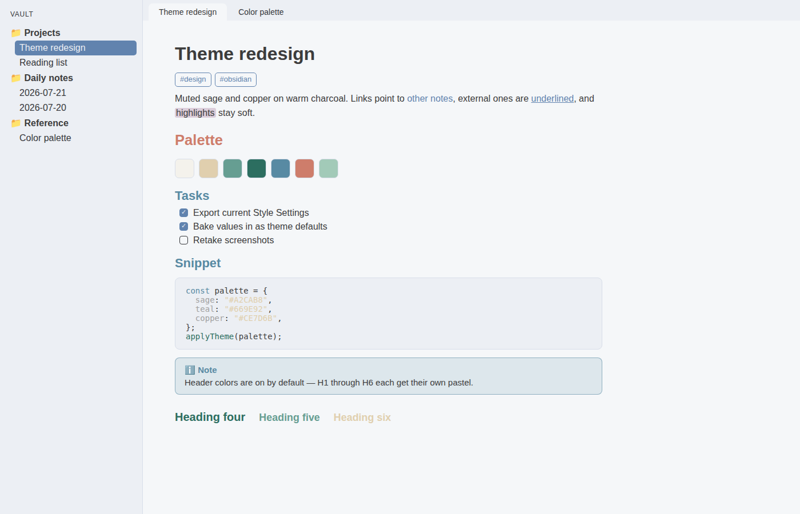

# Verdigris

A personal Obsidian theme by Ryan McCarty. Muted sage, teal, and copper accents on warm charcoal.

Forked from PLN (Pipe Likes Nord) by PipeItToDevNull, keeping its Style Settings options (settings id remains `pln`, so existing PLN settings carry over) with new default colors, fonts, and header styling.

## Defaults

- Accent palette: `#F4F2EC` `#E0CFAE` `#669E92` `#2C6E60` `#588AA3` `#CE7D6B` `#A1A1A1`
- Backgrounds: `#3C3C3C` `#36373B` `#4D4D4D` `#545454`, sage `#A2CAB8`
- Header colors on by default (white through pastel spectrum, H1–H6)
- UI fonts: 12 / 16 / 14 / 16 px
- Statusbar, tab-list icon, tab close X, macOS top bar, and search help hidden

All of it is adjustable via the [Style Settings](https://github.com/mgmeyers/obsidian-style-settings) plugin. See `StyleSettings.md` for the full option list.

## Snippets

Optional CSS snippets live in `snippets/`: custom checkboxes, folder colors, highlighters, multi-row tabs, unique tables, lock.

## License

GPL-3.0, same as upstream. See `LICENSE.md`.
